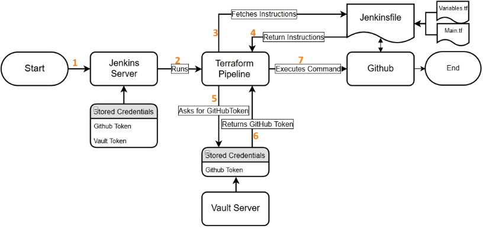

# GitHubTF-Pipeline

The objective of this document is to lay out the process of integrating a GitOps workflow utilizing Terraform and Jenkins to streamline the operational processes of OLE's repositories and teams.
The goal will be to integrate the use of infrastructure as code methodologies to allow for faster management of Virtual Intern membership and team participation.
Utilizing the open source automation server ‘Jenkins’ a pipeline has been created that integrates the use of Terraform, GitHub and Vault. The use of Webhooks allows for any PR or Master merge to automatically result in the initiation of the process. 
This document will cover how to set up the various elements needed to successfully run the pipeline. 

The completed pipeline will execute the following actions
The Jenkins server is launched (1) and stores GitHub and a Multibranch Pipeline is set up (2) that fetches a set of instructions stored in a Jenkinsfile (3) which we have placed on GitHub itself. Using a Webhook, the pipeline retrieved the information from the targeted repository (4) 
In order to execute the commands it finds, the pipeline will have to provide GitHub with Valid Credentials. These can unfortunatly not be those stored directly in Jenkins and used for the webhook, a way of doing this is still being explored. 
The pipeline uses stored Vault Credentials (5) to fetch GitHub credentials (6) which are then used to apply the desired changes to GitHub (6). In our case we have included a series of Terraform instructions that will be executed.   
 

